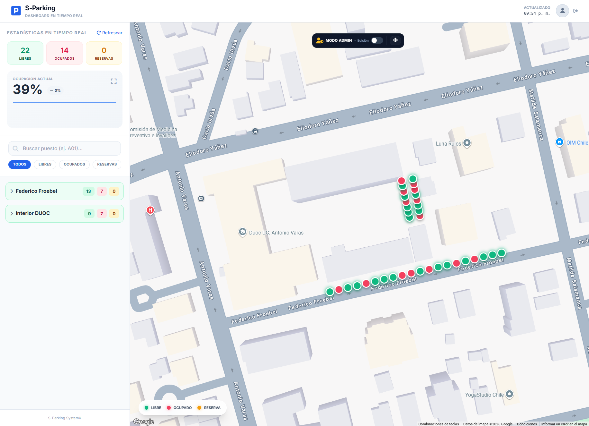
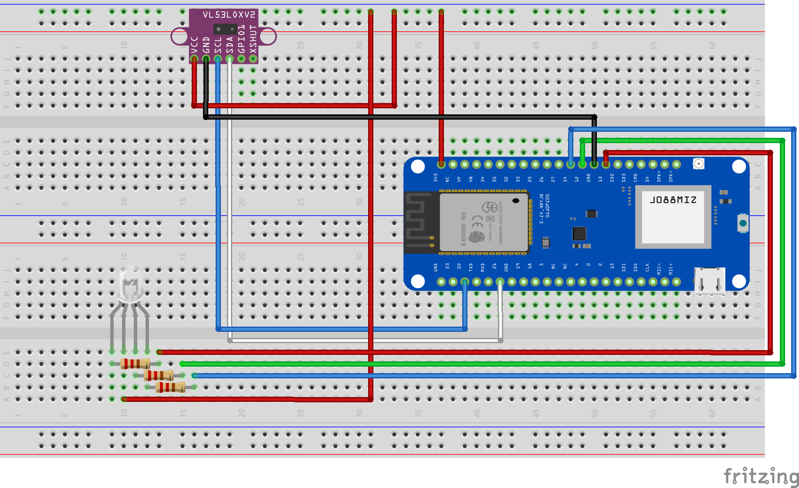
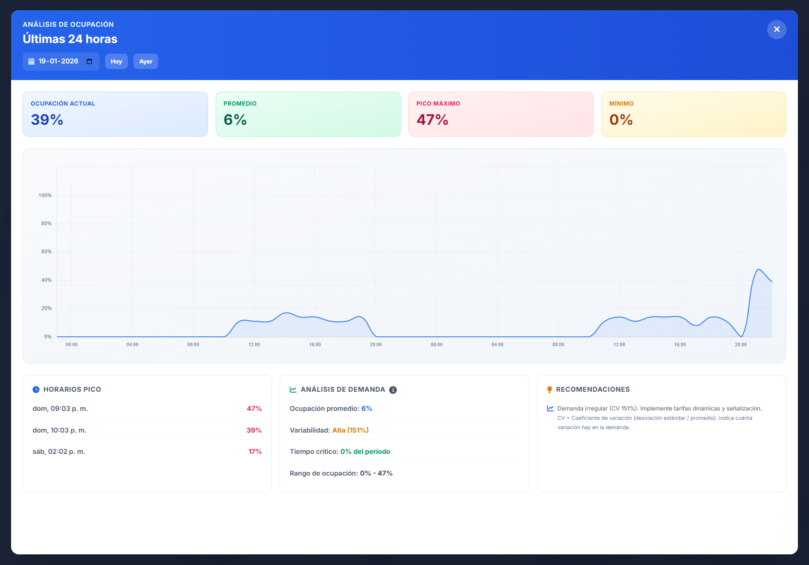
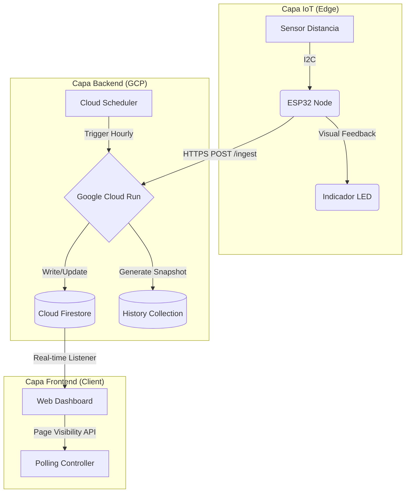

# S-Parking: Ecosistema IoT & Cloud para Estacionamientos Inteligentes 🚗💨

<div align="center">


<br />


</div>

---

## 📖 Visión General

**S-Parking** es una plataforma integral de gestión de estacionamientos que digitaliza la infraestructura física mediante tecnología IoT y Cloud Computing. El sistema monitorea la ocupación en tiempo real utilizando sensores láser, procesa la data mediante una arquitectura *serverless* en Google Cloud Platform y entrega analítica predictiva para la toma de decisiones.

> **Nota de Autoría:** Proyecto diseñado y desarrollado *End-to-End* por **Joaquín Troncoso**.

---

## 📸 Demostración del Sistema

| Dashboard en Tiempo Real | Hardware IoT (Prototipo) | Analítica de Datos |
| :---: | :---: | :---: |
|  |  |  |

---

## ✨ Funcionalidades Clave

* **📍 Monitoreo en Vivo:** Visualización de plazas libres/ocupadas con latencia < 2 segundos.
* **📅 Sistema de Reservas:** Gestión de disponibilidad y bloqueos temporales por usuario.
* **🛠️ Modo Constructor:** Herramienta visual para que los administradores dibujen y configuren nuevas zonas de estacionamiento directamente sobre el mapa.
* **📊 Dashboard Analítico:** Métricas de ocupación, rotación y horas pico generadas automáticamente.
* **🔍 Filtros Inteligentes:** Búsqueda rápida por zona, estado o disponibilidad.

---

## 🏗️ Arquitectura del Sistema (Cloud-Native)

El sistema implementa una arquitectura de tres capas orientada a eventos, garantizando alta disponibilidad y consistencia de datos.



1.  **Edge Layer (IoT):** Nodos **ESP32** con sensores de distancia de alta precisión. Ejecutan lógica de *Self-Healing* y poseen señalización visual para el usuario en sitio.
2.  **Serverless Backend:** Microservicios en **Node.js 20** hosteados en **Google Cloud Run**, encargados de la ingesta de datos, gestión de zonas y lógica de negocio (Reservas/CRUD).
3.  **Persistence Layer:** **Firestore** actúa como base de datos en tiempo real. Se utilizan colecciones separadas para el estado actual (`parking_spots`) y la analítica histórica (`hourly_snapshots`).
4.  **Frontend Optimizado:** SPA construida en **Vanilla JS** (ES6+) para máximo rendimiento, implementando *Code Splitting* y gestión de estado global sin frameworks pesados.

---

## 🛠️ Stack Tecnológico

### ☁️ Infraestructura & Cloud (GCP)
* **Compute:** Cloud Run (Containerized Node.js 20 microservices).
* **Database:** Cloud Firestore (NoSQL Real-time).
* **Orquestación:** Cloud Scheduler (Cron Jobs para snapshots de analítica).
* **Hosting:** Firebase Hosting (HTTP/2, SSL Global).
* **Auth:** Firebase Authentication (Email/Password & Custom Claims).

### ⚡ Hardware & Firmware
* **MCU:** ESP32.
* **Sensor:** Sensor de distancia (Tecnología ToF/LiDAR).
* **Actuadores:** Indicadores LED RGB.
* **Comunicaciones:** WiFi 802.11 b/g/n, Cliente HTTP seguro.

### 💻 Frontend
* **Core:** HTML5, CSS3, JavaScript ES6+ (Módulos nativos).
* **Mapas:** Google Maps JavaScript API (Styling personalizado + Custom Overlays).
* **UI System:** Tailwind CSS (Utility-first).
* **Data Viz:** Chart.js 4.x (Gráficos de ocupación y tendencias).

---

## 🚀 Ingeniería y Optimizaciones

Este proyecto implementa soluciones avanzadas para problemas comunes en sistemas distribuidos:

* **Page Visibility API & Polling Adaptativo:** El dashboard detecta si el usuario tiene la pestaña activa. Si está en segundo plano, el sistema pausa el *polling* de datos y las suscripciones, reduciendo las lecturas a Firestore y los costos operativos en un **80%**.
* **Caché Inteligente Multi-Capa:** Implementación de caché en memoria (TTL 15s) y localStorage para estado de puestos, zonas e historial. Reduce la latencia de UI y minimiza las invocaciones a Cloud Run.
* **Smart Builder & Ruler:** Herramienta desarrollada sobre la API de Mapas que permite a los administradores "dibujar" estacionamientos masivos en grid o línea, con cálculo automático de distancias (Haversine) para evitar superposiciones.
* **Consistencia de Datos (Truth Source):** Manejo de conflictos mediante timestamps de servidor, priorizando siempre la lectura física del sensor ante reconexiones de red.

---

## 🔮 Roadmap y Futuro

La evolución del proyecto contempla las siguientes integraciones:

* [ ] **Mobile App Nativa:** Desarrollo en Flutter para notificaciones push a conductores.
* [ ] **Machine Learning:** Modelo predictivo de demanda basado en TensorFlow Lite.
* [ ] **Pasarela de Pagos:** Integración para cobro automático por tiempo de uso.
* [ ] **API Pública:** Exposición de endpoints para integración con terceros.

---

## 📂 Estructura del Repositorio

El proyecto sigue una estructura modular limpia:

```text
/
├── firmware/               # Código C++ para ESP32
│   └── src/                # Lógica de sensores y conexión WiFi
├── gcp-functions/          # Microservicios Cloud Run (Node.js)
│   ├── manage-zones/       # Lógica de administración de zonas
│   └── ingest-data/        # Endpoint de recepción IoT
├── public/                 # Frontend (SPA)
│   ├── js/
│   │   ├── api/            # Capa de abstracción API (parking.js, zones.js)
│   │   ├── map/            # Lógica Google Maps (core.js, builder.js)
│   │   ├── ui/             # Componentes de interfaz (sidebar.js, charts.js)
│   │   └── utils/          # Helpers (validators.js, formatters.js)
│   └── css/                # Tailwind styles
└── README.md
```

---

## ⚙️ Instalación y Despliegue

### Requisitos
* Node.js v20+ & NPM
* Google Cloud SDK & Firebase CLI
* Hardware ESP32 y sensores compatibles

### 1. Despliegue Backend (Cloud Run)
```bash
# Construir imagen del contenedor
gcloud builds submit --tag gcr.io/proyecto-id/ingest-parking-data

# Desplegar en Cloud Run (Managed)
gcloud run deploy ingest-parking-data \
  --image gcr.io/proyecto-id/ingest-parking-data \
  --platform managed \
  --allow-unauthenticated
```

### 2. Configuración Frontend
```javascript
// Renombrar config/config.example.js a config.js
const CONFIG = {
    API_BASE: 'https://[TU-CLOUD-RUN-URL].run.app',
    GOOGLE_MAPS_API_KEY: '[TU-API-KEY]',
    FIREBASE_CONFIG: { ... }
};
```

### 3. Firmware (ESP32)
1.  Configurar credenciales WiFi y Endpoint API en `secrets.h`.
2.  Calibrar el umbral del sensor según la altura de instalación.
3.  Flashear usando PlatformIO o Arduino IDE.

---

## 👤 Autor

<div align="center">

### **Joaquín Troncoso Muñoz**
**Ingeniero en Infraestructura y Plataformas Tecnológicas**

*Especialista en Integración Cloud, IoT y Ciberseguridad.*

[](https://www.linkedin.com/in/joaquint/)
[](mailto:joaquin.ltm@gmail.com)

</div>

* **Certificaciones:** Scrum Fundamentals Certified (SFC™).
* **Enfoque:** Arquitecturas Serverless, Automatización y Sistemas Embebidos.

---
© 2026 S-Parking Project. Todos los derechos reservados.